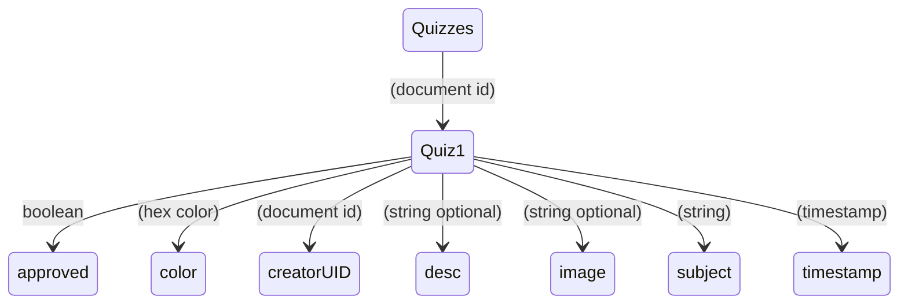
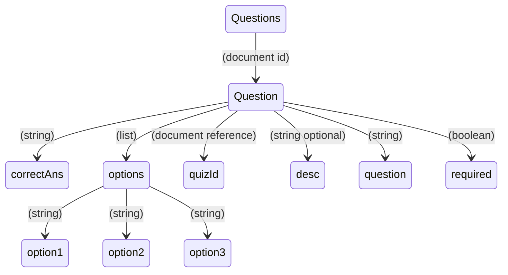
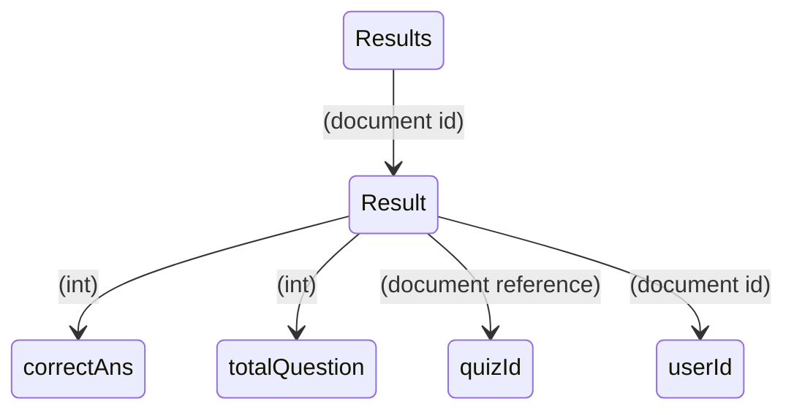

# 🍀 Android Quiz App

Android Quiz App is an **quiz** application for Android devices written in Kotlin. It is designed to
create and take quizzes in a variety of topics, similar to 🟣 Google Forms.
The app is backed by Firebase, a mobile and web application development platform that provides
backend as a service (BaaS).

## Features

These are some of the main features provided by the app

- ♻ Contribute and save quizzes
- 🏫 Take quizzes with multiple choice questions
- 📋 Results tracking
- 🙍 User Authentication
- 🎨 Profile management

## Screenshots

<p align="center">

Theses are some of the **screenshots** for the app. For more screenshots head
to [screenshots](./screenshots).

</p>

<div align="center">
  
  
  
  
  
  l̥
  
  
</div>

## 🧑‍🚀 Installation

To install Android Quiz App, follow these steps:

1. Clone the repository to your local machine:

   ```bash
      git clone https://github.com/tuuhin/AndroidQuizApp.git
   ```

2. Add the `google-services.json` file in the `app` directory of the project. This file contains
   your Firebase project configuration and is necessary for the app to function properly. You can
   obtain this file by creating a new Firebase project and linking it to your app.

3. Build and run the project on an emulator or physical device.

## 📱 Usage

To use Android Quiz App, simply select the "Create Quiz" option from the main menu and add your
questions and multiple choice answers. Once your quiz is created and approved by the admin, then
other users including you can "Take Quiz" option Quiz Tab. The application will present the
questions to the user in randomized order in multiple option format. After completing the quiz, the
user's have to submit the quiz and then he/she can see the results in
the Home Tab.

## 🧨 Firebase Integration

Android Quiz App is integrated with Firebase, a mobile and web application development platform that
provides backend as a service (BaaS). The app uses Firebase Authentication to authenticate users,
Firebase Cloud FireStore to store quiz data, and Firebase Cloud Storage to store images for quizzes.

### 🔥 FireStore Data Modeling

Firebase being a **nosql** based database,This is the way the data is stored in the firestore
database

1. **Quiz Model**



2.**Question Model**



3.**Results Model**



### 🤙Contributing

If you would like to contribute to Android Quiz App, please follow these steps:

1. Fork the repository on Github.
2. Create a new branch with your changes.
3. Commit your changes and push your branch to your fork.
4. Submit a pull request to the main repository.

### Conclusion

Android Quiz App is a modern and easy-to-use quiz application for Android devices. With its simple
and intuitive user interface, it allows users to create and take quizzes in a variety of subjects.

Backed by Firebase, it offers reliable and secure data storage and authentication. The addition of
user login and profile management enables users to track their quiz results across devices.

We hope you enjoy using Android Quiz App and welcome any feedback or suggestions for improvement.
